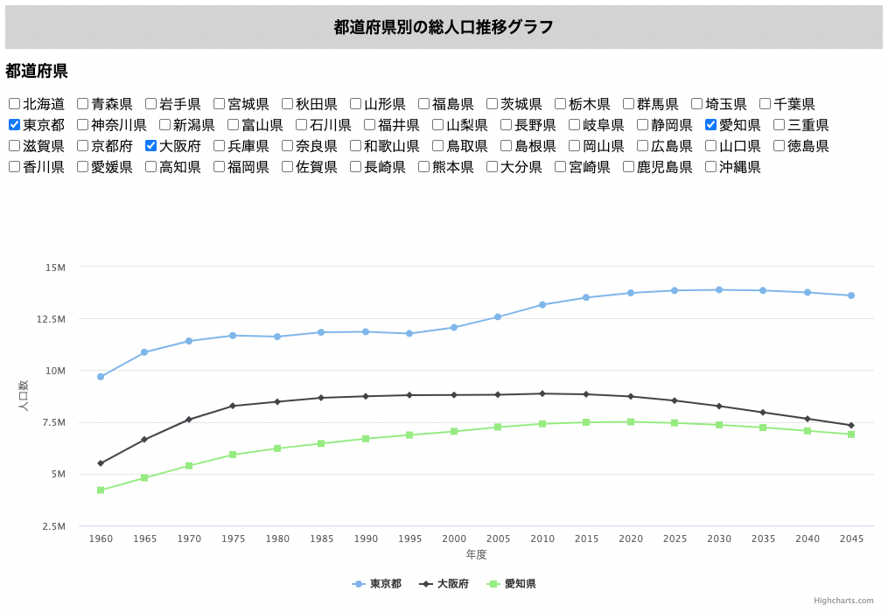

# population_graph_js
都道府県別の総人口推移グラフを表示するSPAです。データは[RESAS API](https://opendata.resas-portal.go.jp/)のAPIから取得しています。グラフは[Highcharts](https://www.highcharts.com/)を用いて描画しています。

# 準備
cloneした上で、env.jsというファイルを作成し、以下のようにコードを書いてください。その際、[RESAS API](https://opendata.resas-portal.go.jp/)から利用登録を行い、API Keyを発行してください。

```
export const API_KEY = '取得したAPI Key';
```

# 使い方
index.htmlをブラウザで開くと、都道府県のチェックボックスが表示されます。チェックボックスを押すとグラフが描画され、チェックボックスを外すとグラフが消えます。

<div align="center">
    
</div>